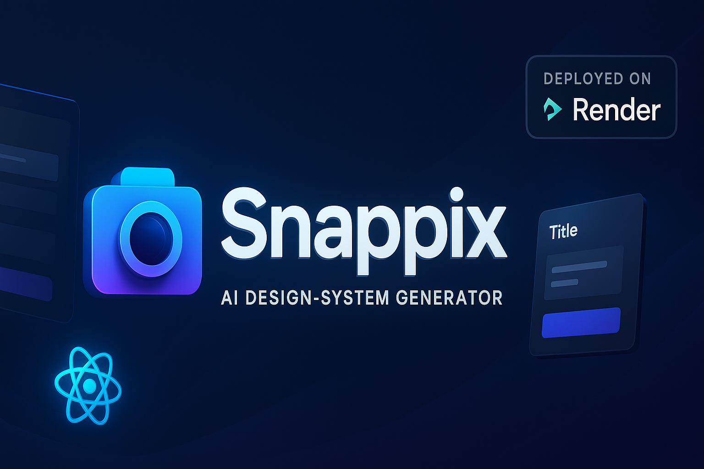
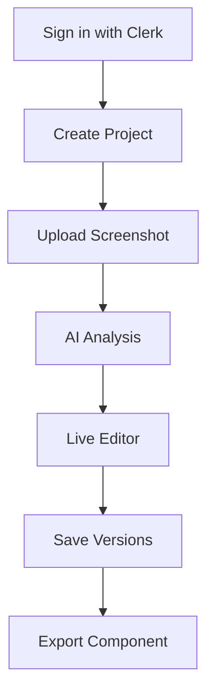

# 📸 Snappix – AI Design-System Generator

<div align="center">
  
</div>

<div align="center">
  
**Transform your Figma screenshots into production-ready React components with AI**

[](https://snappixai.onrender.com)
[](LICENSE)
[](https://nextjs.org/)
[](https://openai.com/)

</div>

---

## 📌 What is Snappix?

Snappix is a revolutionary AI-powered tool that transforms design screenshots into production-ready code. Simply upload a Figma screenshot, and Snappix will generate a complete React component with Tailwind CSS styling, Storybook stories, design tokens, and version history - all in under 30 seconds.

### 🌟 Core Value Proposition
- **Seamless Design-to-Code**: Eliminate manual coding with AI-powered component generation
- **Complete Ecosystem**: Get not just components, but documentation, tokens, and version control
- **Multi-format Export**: Choose from component-only to full Next.js project exports
- **Cloud-Native Architecture**: Built for scalability with modern web technologies

---

## ✨ Key Features

| Feature | Description | Technology |
|---------|-------------|------------|
| 📤 **Drag-&-Drop Upload** | Support for PNG, JPG, WebP screenshots (≤ 5 MB) | HTML5 File API |
| 🤖 **AI Vision Analysis** | GPT-4o parses layout, colors, typography & spacing | OpenAI GPT-4o Vision |
| ⚡ **Live Code Editor** | Monaco Editor with real-time Sandpack preview | Monaco Editor, Sandpack |
| 🔄 **Version Control** | Save, diff, and restore every iteration | Custom Versioning System |
| 📦 **One-Click Export** | Multiple export formats for different needs | Custom Export Engine |
| 🔐 **Auth & Multi-tenancy** | Clerk-powered authentication per user | Clerk |
| 🗄️ **Cloud Native** | PostgreSQL, Blob storage, Render Hosting | Supabase, Vercel Blob, Render |

---

## 🛠️ Technology Stack

<div align="center">

| Category | Technologies |
|----------|--------------|
| **Frontend** |    |
| **Styling** |   |
| **Editor** |   |
| **AI** |  |
| **Database** |   |
| **Storage** |  |
| **Authentication** |  |
| **Deployment** |  |

</div>

---

## 📦 Environment Configuration

Create a `.env.local` file in the root directory with the following variables:

| Variable | Purpose | Required |
|----------|---------|----------|
| `OPENAI_API_KEY` | GPT-4o Vision API access | Yes |
| `POSTGRES_PRISMA_URL` | Supabase PostgreSQL connection | Yes |
| `NEXT_PUBLIC_CLERK_PUBLISHABLE_KEY` | Clerk client-side authentication | Yes |
| `CLERK_SECRET_KEY` | Clerk server-side authentication | Yes |
| `BLOB_READ_WRITE_TOKEN` | Vercel Blob storage access | Yes |

> ⚠️ **Security Note**: Never commit your `.env.local` file to version control. Add it to your `.gitignore` file.

---

## 🚀 Getting Started

### Prerequisites
- Node.js 18.0 or later
- npm or yarn package manager
- OpenAI API key
- Clerk authentication credentials
- Supabase PostgreSQL database

### Installation

1. **Clone the repository**
   ```bash
   git clone https://github.com/mohitbansal25082006/snappixai.git
   cd snappixai
   ```

2. **Install dependencies**
   ```bash
   npm install
   ```

3. **Set up environment variables**
   ```bash
   cp .env.example .env.local
   # Fill in your credentials from the Environment Configuration section
   ```

4. **Set up database and Prisma**
   ```bash
   npx prisma generate
   npx prisma db push
   ```

5. **Run the development server**
   ```bash
   npm run dev
   ```

---

## 📖 How It Works

<div align="center">



</div>

1. **Authentication**  
   Sign in with Clerk using your preferred method (email, Google, GitHub, etc.)

2. **Project Creation**  
   Create a new project or select an existing one from your dashboard

3. **Screenshot Upload**  
   Upload your Figma screenshot (PNG, JPG, or WebP, max 5MB) via drag-and-drop

4. **AI Analysis**  
   Snappix uses GPT-4o Vision to analyze the layout, colors, typography, and spacing

5. **Live Editing**  
   Edit the generated code in Monaco Editor with real-time Sandpack preview

6. **Version Control**  
   Save iterations of your component, compare versions visually, and restore previous states

7. **Export**  
   Export your component in various formats:
   - Single React component
   - Storybook stories
   - Design tokens
   - Complete Next.js starter project

---

## 📦 Export Formats

| Format | Contents | Use Case |
|--------|----------|----------|
| **React Component** | `.tsx`, `.css`, `package.json` | Integration into existing projects |
| **Storybook Story** | `.stories.tsx` with knobs & controls | Component documentation and testing |
| **Design Tokens** | `design-tokens.json`, `variables.css` | Design system consistency |
| **Next.js Starter** | Full project with routing, Tailwind, TypeScript | Complete application foundation |

---

## 🎯 Use Cases

- **Design-to-Dev Handoff**  
  Eliminate manual coding and accelerate the handoff process between designers and developers

- **Rapid Prototyping**  
  Test UI ideas and iterate quickly with AI-generated components

- **Design-System Building**  
  Generate reusable tokens and components for consistent design systems

- **Portfolio Sites**  
  Showcase components with live Storybook demonstrations

---

## 🔐 Security

- **Authentication**  
  Clerk provides password-less, social, and magic-link authentication

- **Data Protection**  
  Prisma Query Logging is disabled in production to prevent sensitive data exposure

- **Secure Connections**  
  HTTPS enforced via Render + Cloudflare for all communications

- **Privacy**  
  No Personally Identifiable Information (PII) stored in logs or telemetry

---

## 📊 Performance

- **Global CDN**  
  Content delivered via Render's global CDN for fast access worldwide

- **Database Optimization**  
  Prisma Accelerate available for sub-50ms queries (optional)

- **Frontend Optimization**  
  Lazy-loading images, code-splitting, and Incremental Static Regeneration (ISR) on demand

---

## 🤝 Contributing

We welcome contributions from the community! Here's how you can help:

1. **Report Bugs**  
   Open an issue describing the problem in detail

2. **Suggest Features**  
   Share your ideas for new functionality or improvements

3. **Submit Pull Requests**  
   Fork the repository, make your changes, and submit a PR for review

4. **Improve Documentation**  
   Help us make our documentation clearer and more comprehensive

---

## 🙏 Acknowledgements

We're grateful to these amazing projects and services that make Snappix possible:

- **OpenAI** for GPT-4o Vision, the backbone of our AI analysis
- **Clerk** for frictionless authentication and user management
- **Render** for zero-config deployment and auto-scaling
- **shadcn/ui** for beautiful, accessible components
- **Supabase** for providing an excellent PostgreSQL solution
- **Vercel** for Blob storage and hosting infrastructure

---

## 🔒 License

This project is licensed under the MIT License - see the [LICENSE](LICENSE) file for details.

<div align="center">

**© 2023 Snappix. All rights reserved.**

[](https://snappixai.onrender.com)
[](https://github.com/mohitbansal25082006/snappixai)

</div>
